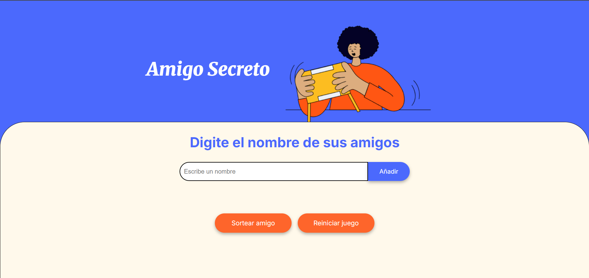

# 🎉 Amigo Secreto

Aplicación web para organizar intercambios de regalos mediante sorteo aleatorio.

## 📝 Descripción

Una herramienta simple que permite agregar participantes a una lista y sortear un "amigo secreto" de manera aleatoria para intercambios de regalos.




## ✨ Funcionalidades

- ✅ **Agregar participantes** con validación de nombres
- ✅ **Prevenir duplicados** y nombres inválidos
- ✅ **Sorteo aleatorio** de participantes
- ✅ **Visualización en tiempo real** de la lista
- ✅ **Reiniciar juego** para empezar de nuevo

## 🛠️ Tecnologías

- HTML5, CSS3, JavaScript (ES6)
- Sin dependencias externas

## 🚀 Uso

1. **Agregar**: Escribe un nombre y haz clic en "Añadir"
2. **Sortear**: Con al menos 2 nombres, haz clic en "Sortear amigo"
3. **Reiniciar**: Limpia la lista con "Reiniciar juego"

## 📁 Estructura

```
├── index.html    # Interfaz de usuario
├── style.css     # Estilos visuales
├── app.js        # Lógica de la aplicación
└── assets/       # Recursos gráficos
```

## 🎯 Validaciones Implementadas

- Solo letras y espacios en nombres
- No permite campos vacíos
- Evita nombres duplicados
- Verifica lista válida antes del sorteo

## 🌐 Instalación

1. Descarga los archivos
2. Abre `index.html` en tu navegador
3. ¡Listo para usar!
